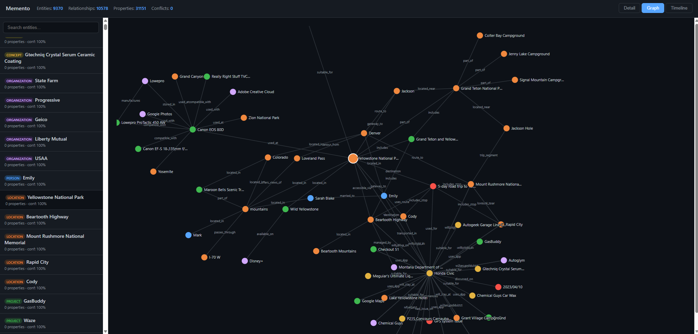

# Memento


Memento is a bitemporal knowledge graph, tracking when facts were true vs. when they were learned, which gives AI agents persistent, structured memory across LLM providers, clients, and conversations.

Most AI memory systems use folders of text files or dump text into a vector store and retrieve by similarity. Memento builds a knowledge graph that resolves entities, detects contradictions, tracks time, and composes answers from structured relationships rather than raw chunks.

Works with any MCP-compatible client (Claude Desktop, Cursor, Claude Code, Codex, Cline, Windsurf, OpenClaw) and any LLM backend (Claude, GPT, Gemini, Llama, Mistral, Ollama, or any OpenAI-compatible endpoint).

**90.8% overall accuracy, 92.2% task average on [LongMemEval](BENCHMARKS.md)** (500 questions, end-to-end, GPT-4o judge), a benchmark for long-term conversational memory covering temporal reasoning, knowledge updates, multi-session recall, and preference tracking.

## Quick start

### MCP server

```bash
pip install memento-memory[anthropic]
export ANTHROPIC_API_KEY=your-key
memento-mcp
```

Set your API key in your shell profile (`~/.zshrc`, `~/.bashrc`, or Windows system environment variables) rather than hardcoding it in config files:

```bash
export ANTHROPIC_API_KEY=your-key
```

Then add to your MCP client config (e.g., Claude Desktop `claude_desktop_config.json`), referencing the variable with `${...}` expansion:

```json
{
  "mcpServers": {
    "memento": {
      "command": "memento-mcp",
      "env": { "ANTHROPIC_API_KEY": "${ANTHROPIC_API_KEY}" }
    }
  }
}
```

This keeps your key out of config files that may be synced, committed to dotfile repos, or shared in screenshots. Variable expansion is supported by Claude Desktop, Cursor, Cline, Windsurf, and Continue.dev. For clients that don't expand `${VAR}`, launch the client from a shell where the variable is already set.

That's it. The agent now has persistent memory and calls `memory_ingest` to store facts and `memory_recall` to retrieve them. Every MCP client on the same machine shares the same knowledge graph.

Memories are stored locally in a SQLite database at `~/.memento/memento.db` (override with `MEMENTO_DB_PATH`). Nothing leaves your machine unless you configure a cloud LLM provider for entity extraction.

### Compatible clients

Any MCP-compatible client works with Memento. Add the config block above to:

| Client | Config location |
|---|---|
| **Claude Desktop** | `claude_desktop_config.json` |
| **Claude Code** | `claude_code_config.json` or `--mcp-config` flag |
| **Cursor** | Settings or `~/.cursor/mcp.json` |
| **Cline** | MCP server settings |
| **Windsurf** | MCP server settings |
| **OpenClaw** | See [OpenClaw setup](#openclaw) below |
| **Codex CLI** | `.codex/config.yaml` MCP servers |
| **Gemini CLI** | `gemini mcp add memento -- memento-mcp` |
| **OpenCode** | `.opencode/config.json` MCP servers |
| **Goose** | `~/.config/goose/config.yaml` MCP servers |
| **Kilo Code** | MCP server settings |
| **Continue.dev** | MCP server settings |

### OpenClaw

```bash
pip install "memento-memory[anthropic]"  # or [openai] / [gemini]
openclaw mcp set memento '{"command":"memento-mcp"}'
openclaw gateway restart
```

Make sure `ANTHROPIC_API_KEY` (or your chosen provider's key) is available to the OpenClaw process. For a systemd install, add it to `/etc/openclaw/env` and run `sudo systemctl restart openclaw`. For a user-level install, export it in the shell where you run `openclaw`.

### Python API

```python
from memento import MemoryStore

store = MemoryStore()

# Ingest — extracts entities, resolves against the graph, detects contradictions
store.ingest("John Smith is VP of Sales at Alpha Corp.")
store.ingest("Alpha Corp is acquiring Beta Inc.")

# Recall — graph traversal + ranking + context budgeting
memory = store.recall("What should I know about John?")
print(memory.text)
# ## John Smith (person)
# - title: VP of Sales
# - → [works_at] Alpha Corp
#
# ## Alpha Corp (organization)
# - → [acquiring] Beta Inc

# Point-in-time queries
memory = store.recall("Where was John in January?", as_of="2025-01-31T00:00:00Z")

# Direct manipulation
store.correct(entity_id, "title", "VP of Sales", reason="Promoted")
store.forget(entity_id=entity_id)
store.merge(entity_a_id, entity_b_id)

# Introspection
conflicts = store.conflicts()
health = store.health()
entities = store.entity_list()

# Privacy
export = store.export_entity_data(entity_id)
chain = store.audit_belief(entity_id, "title")
receipt = store.hard_delete(entity_id)

# Consolidation
store.consolidate()

# Session tracking (scratchpad with coreference)
session = store.start_session()
session.on_turn("I met John Smith today.")
session.on_turn("He mentioned a new project.")
session.end()  # Flushes through ingestion pipeline
```

## LLM providers

Memento is provider-agnostic. Swap the backend via config with no code changes.

| Provider | Install | Config |
|---|---|---|
| **Anthropic** | `pip install memento-memory[anthropic]` | `ANTHROPIC_API_KEY` |
| **OpenAI** | `pip install memento-memory[openai]` | `OPENAI_API_KEY`, `MEMENTO_LLM_PROVIDER=openai` |
| **Google Gemini** | `pip install memento-memory[gemini]` | `GOOGLE_API_KEY`, `MEMENTO_LLM_PROVIDER=gemini` |
| **Ollama** (fully local) | `pip install memento-memory[openai]` | `MEMENTO_LLM_PROVIDER=ollama` |
| **Any OpenAI-compatible** | `pip install memento-memory[openai]` | `MEMENTO_LLM_PROVIDER=openai-compatible`, `MEMENTO_LLM_BASE_URL=...` |

## How it works

```
Agent / LLM
  │ query              │ ingest
  ▼                    ▼
Retrieval Engine    Ingestion Pipeline
  │                    │
  ▼                    ▼
Bitemporal Knowledge Graph (SQLite)
  │
  ├── Consolidation Engine (decay, dedup, prune)
  ├── Verbatim Fallback (FTS5 + vector search)
  └── Privacy Layer (export, audit, hard delete)
```

- **Entity resolution** - "John," "John Smith," and "the Alpha Corp guy" become one node. Tiered matching: exact/fuzzy/phonetic (cheap) before embedding similarity and LLM tiebreaker (expensive).
- **Contradiction detection** - flags when new facts conflict with existing ones.
- **Bitemporal model** - every fact tracks when it was true (valid time) and when the system learned it (transaction time).
- **Immutable history** - facts are never deleted, only superseded. Full audit trail.
- **Verbatim fallback** - raw text stored alongside the graph, so extraction loss doesn't mean information loss.
- **Compositional retrieval** - "What should I know before my meeting with John?" traverses the graph, not just retrieves chunks.
- **Confidence decay** - multiplicative decay prevents artificial confidence floors from repeated confirmations.
- **Consolidation** - background engine decays stale info, merges duplicates, prunes orphans.

## Benchmarks

**90.8% end-to-end accuracy on LongMemEval** with Claude Sonnet 4.6 (500 questions, GPT-4o judge):

| Category | Accuracy |
|---|--:|
| Single-session (assistant) | 98.2% |
| Single-session (user) | 97.1% |
| Single-session (preference) | 93.3% |
| Temporal reasoning | 89.5% |
| Knowledge update | 88.5% |
| Multi-session | 86.5% |
| **Task-averaged** | **92.2%** |

> **What this number actually measures.** This is the full pipeline, not a retrieval-only metric like `recall@k` or `R@5`. For each of the 500 questions, we ingest the haystack sessions, retrieve context via `store.recall()`, generate an answer with the LLM, and have GPT-4o judge the answer against the reference using LongMemEval's task-specific judge prompts. A question only counts as correct if the retrieved context was sufficient *and* the LLM composed a correct answer from it *and* the judge agrees it matches the reference. No per-question tuning, hand-curated prompts, or oracle routing. The harness is one file: [`benchmarks/longmemeval/run_benchmark.py`](benchmarks/longmemeval/run_benchmark.py). Reproduce with `python run_benchmark.py run --variant oracle`.

### vs. baselines

To isolate what structured memory contributes, we ran the same 500 questions through two simpler approaches. Same dataset, same answer model (Claude Sonnet 4.6), same `ANSWER_PROMPT`, same 4,000-token context budget, same GPT-4o judge, and only the recall layer differs.

- **Vector store** - a minimal in-memory RAG system. Each haystack turn is embedded individually with `sentence-transformers/all-MiniLM-L6-v2` (the same model Memento uses) and stored in a numpy array. At query time, cosine similarity returns the top-30 most similar turns, which are concatenated (with their session dates) into the context block. No chunking, no reranker, no graph, just pure similarity search.
- **Markdown file** - simulates the CLAUDE.md / USER.md / mem0 pattern. For each session, an LLM distills the conversation into bulleted facts tagged with the session date and appends them to a single markdown file. At query time, the full file is truncated to the token budget and passed into the answer prompt.

| Category | Markdown | Vector | **Memento** |
|---|--:|--:|--:|
| Single-session (assistant) | 41.1% | 100.0% | **98.2%** |
| Single-session (preference) | 100.0% | 100.0% | 93.3% |
| Single-session (user) | 94.3% | 94.3% | **97.1%** |
| Knowledge update | 88.5% | 87.2% | **88.5%** |
| Multi-session | 80.5% | 67.7% | **86.5%** |
| Temporal reasoning | 82.0% | 66.9% | **89.5%** |
| **Overall** | 80.8% | 79.8% | **90.8%** |

Vector retrieval handles single-conversation lookups fine but falls apart on multi-session synthesis and temporal reasoning. Markdown extraction captures some cross-session structure but loses ~60% of assistant-side questions because LLM distillation skews toward user statements. Memento is the only approach without a real failure mode with its worst category at 86.5% vs. 41.1% (markdown) and 66.9% (vector).

### Any model, same memory

Memento is model-agnostic. The same knowledge graph works across providers - only the answer-generation LLM changes. Same Memento graph, retrieval pipeline, and GPT-4o judge.

**Full 500-question runs:**

| Model | Provider | Overall | Task-avg |
|---|---|--:|--:|
| **Claude Sonnet 4.6** | Anthropic | **90.8%** | **92.2%** |
| **MiniMax M2.7** | Together (MiniMax) | **90.6%** | **91.2%** |
| GLM 5.1 FP4 | Together (Zhipu) | 87.4% | 90.2% |
| Qwen 3 235B A22B | Together (Alibaba) | 79.6% | 80.1% |

MiniMax M2.7 essentially ties Claude Sonnet 4.6 on the full 500-question run, and GLM 5.1 is within a few points. When the memory layer is structured and retrieval is strong, the answer model doesn't need to be the flagship. A competitive open-source model matches proprietary performance.

Full methodology and reproduction steps: [BENCHMARKS.md](BENCHMARKS.md)

## Web viewer

Browse the knowledge graph in your browser with a built-in web UI:

```bash
pip install memento-memory[web]
memento-web
```

Open http://localhost:8766. The viewer reads from the same `~/.memento/memento.db` that `memento-mcp` writes to so you can watch your agent's memories update in real time.



- **Entity list** — search and filter by type (person, organization, project, etc.)
- **Detail view** — properties, relationships, version history, confidence scores
- **Graph view** — interactive force-directed visualization with d3.js (zoom, drag, click to navigate)
- **Timeline view** — when facts were learned vs. when they were true (bitemporal)

## CLI

Admin and introspection tools for the knowledge graph:

```bash
memento entities                        # List all entities
memento entity <id>                     # Show entity details
memento history <id> <key>              # Property history over time
memento snapshot <id> --as-of 2025-06   # Point-in-time view
memento stats                           # Graph statistics
memento merge <id_a> <id_b>             # Merge two entities
memento consolidate                     # Run maintenance pass
memento export <id>                     # GDPR data export (JSON)
memento audit <id> <key>                # Trace a belief to its source
memento delete <id> --hard              # Hard delete with receipt
```

## Configuration

| Variable | Default | Description |
|---|---|---|
| `MEMENTO_LLM_PROVIDER` | auto-detect | `anthropic`, `openai`, `gemini`, `ollama` |
| `MEMENTO_LLM_API_KEY` | — | API key (or use provider-specific env vars) |
| `MEMENTO_LLM_BASE_URL` | — | For Ollama/vLLM endpoints |
| `MEMENTO_DB_PATH` | `~/.memento/memento.db` | SQLite database path |
| `MEMENTO_EMBEDDING_PROVIDER` | `auto` | `auto`, `sentence-transformers`, `openai`, `gemini`, `ollama` |
| `ANTHROPIC_API_KEY` | — | Anthropic-specific key |
| `OPENAI_API_KEY` | — | OpenAI-specific key |
| `GOOGLE_API_KEY` | — | Gemini-specific key |

## License

MIT
